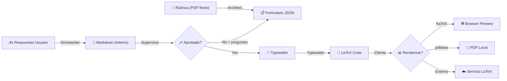

# Explicación Completa del Flujo Scribe

## Resumen Ejecutivo

El sistema **Scribe** es un motor de generación de documentos académicos completamente **basado en AI**. Funciona en **4 etapas secuenciales** ejecutadas por 4 agentes de IA distintos, cada uno especializado en una tarea específica.

**Puntos clave:**
- ✅ **TODO ES MARKDOWN y LATEX** — No se genera PDF
- ✅ **El Markdown es INTERNO** — El cliente nunca ve el markdown, solo el LaTeX final
- ❌ **NUNCA se llama a `PROCESSING_SERVICE_URL`** — Ese servicio es solo para procesamiento de audio en otros workflows
- ✅ **Solo usa Gemini 2.5 Flash Lite** via Vercel AI Gateway (sin modelo selection logic)
- ✅ **Completamente serverless** en Cloudflare Workers + D1 + Durable Workflows
- ✅ **Acumulación de contexto** — Las respuestas del usuario se preservan entre rondas de revisión

---

## Arquitectura del Flujo: State Machine

```
┌─────────┐
│  draft  │ (Proyecto creado)
└────┬────┘
     │ Architect Agent (analiza rubrica)
     ↓
┌──────────────────┐
│collecting_answers│ (Esperando respuestas del usuario)
└────┬─────────────┘
     │ (Usuario envía answers)
     ↓
┌──────────┐
│ drafting │ (Ghostwriter Agent genera contenido)
└────┬─────┘
     ↓
┌──────────┐
│reviewing │ (Supervisor Agent revisa)
└────┬─────┘
     │
     ├─→ ¿Aprobado? ─→ SI ──→ ┌───────────┐
     │                         │typesetting│ (Typesetter Agent convierte a LaTeX)
     │                         └─────┬─────┘
     │                               ↓
     │                         ┌───────────┐
     │                         │ completed │ (Listo para descargar)
     │                         └───────────┘
     │
     └─→ ¿Rechazado? ─→ SI ──→ collecting_answers (Nueva ronda de preguntas)
                               ⚠️ Las respuestas previas se PRESERVAN
                               ⚠️ El markdown previo se pasa al Ghostwriter
```

### Flujo desde la Perspectiva del Cliente

El cliente solo ve estos estados:
1. `collecting_answers` → Formulario para responder (puede repetirse)
2. `completed` → LaTeX listo para renderizar

Los estados intermedios (`drafting`, `reviewing`, `typesetting`) son internos y el cliente puede ignorarlos o usarlos solo para mostrar estados de carga.

---

## Los 4 Agentes IA y Sus Prompts

Todos usan **Google Gemini 2.5 Flash Lite** via Vercel AI Gateway.

### 1️⃣ ARCHITECT AGENT
**Archivo:** `scribe/prompt-01-architect.txt`
**Entrada:** Rúbrica (PDF, imagen, texto)
**Salida:** JSON con estructura de formulario dinámico
**Método IA:** `generateObject()` (salida estructurada)

```typescript
// handler.ts línea 59-73
const output: ArchitectOutput = await this.scribeAIService.runAgentWithSchema(
  ARCHITECT_AGENT,
  {
    fileUrl: project.rubricFileUrl ?? undefined,
    fileMimeType: project.rubricMimeType ?? undefined,
    textContent: project.rubricContent ?? undefined,
  }
);
```

**¿Qué hace?**
- Analiza la rúbrica (de un archivo subido o texto)
- Extrae los puntos clave que necesita del estudiante
- Genera un JSON con secciones y preguntas dinámicas

**Output Schema:**
```typescript
{
  form_title: string,
  estimated_time: string,
  sections: [
    {
      section_title: string,
      questions: [
        {
          id: string,
          type: "select" | "text_input" | "textarea" | "checkbox",
          label: string,
          helper_text?: string,
          options?: string[]
        }
      ]
    }
  ]
}
```

---

### 2️⃣ GHOSTWRITER AGENT
**Archivo:** `scribe/prompt-02-ghostwriter.txt`
**Entrada:** Rúbrica + Respuestas del usuario (JSON) + [Opcional] Markdown previo
**Salida:** Documento en **MARKDOWN** (ojo: no LaTeX aún)
**Método IA:** `generateText()` (salida libre)

**Modos de Operación:**

| Modo | Condición | Comportamiento |
|------|-----------|----------------|
| **MODE A: Initial Draft** | `contentMarkdown` es null | Genera documento desde cero |
| **MODE B: Revision** | `contentMarkdown` existe | Mejora el documento existente con nueva información |

```typescript
// handler.ts - Detección de modo
const isRevision = !!project.contentMarkdown;

if (isRevision) {
  // Incluye: rubric + previous markdown + structured answers + supervisor feedback
  textContent = this.buildRevisionContext(project);
} else {
  // Solo: rubric + user answers
  textContent = `RUBRIC:\n${project.rubricContent}\n\nUSER ANSWERS:\n${JSON.stringify(project.userAnswers)}`;
}
```

**¿Qué hace?**
- Toma las respuestas del usuario (generadas por Architect)
- Las sintetiza en un documento académico completo
- Eleva el tono del lenguaje (convierte texto casual → formal)
- **Salida en MARKDOWN puro** (estructura con headings #, ##, ###)
- **NO genera LaTeX aquí** — es solo Markdown
- **NO usa placeholders** — El documento debe estar completo

**Proceso Inicial (Mode A):**
1. Recibe: `RUBRIC + USER_ANSWERS`
2. Sintetiza, no concatena
3. Estructura lógicamente con encabezados
4. Agrega secciones de Referencias
5. Retorna Markdown limpio

**Proceso de Revisión (Mode B):**
1. Recibe: `RUBRIC + PREVIOUS_MARKDOWN + INITIAL_ANSWERS + REVISION_ANSWERS[] + SUPERVISOR_FEEDBACK`
2. Identifica las áreas que necesitan mejora
3. Integra la nueva información quirúrgicamente
4. Preserva la estructura existente
5. Retorna Markdown mejorado

---

### 3️⃣ SUPERVISOR AGENT
**Archivo:** `scribe/prompt-03-supervisor.txt`
**Entrada:** Markdown generado + Rúbrica (para referencia)
**Salida:** JSON con aprobación o preguntas de revisión
**Método IA:** `generateText()` con parsing

**Reglas Críticas:**
- ❌ **NO PLACEHOLDERS:** Si encuentra `[INSERT...]`, `[TODO]`, etc. → RECHAZA
- ❌ **NO FABRICACIÓN:** Si detecta datos inventados → RECHAZA
- ✅ **MINIMAL INTERVENTION:** Solo pide información estrictamente necesaria

```typescript
// handler.ts
const response = await this.scribeAIService.runAgentWithText(
  SUPERVISOR_AGENT,
  {
    fileUrl: project.rubricFileUrl ?? undefined,
    fileMimeType: project.rubricMimeType ?? undefined,
    textContent: `CONTENT TO REVIEW:\n${project.contentMarkdown}\n\nRUBRIC:\n${project.rubricContent}`,
    templateVars: {
      CONTENT: project.contentMarkdown || "",
      RUBRIC: project.rubricContent || "",
    },
  },
);

// Dos casos:
if (response.includes("STATUS: APPROVED")) {
  return { approved: true };
} else {
  const jsonStr = response.replace(/```json\n?|\n?```/g, "").trim();
  const parsed = JSON.parse(jsonStr); // Extrae preguntas de revisión
  return { approved: false, ...parsed };
}
```

**¿Qué hace?**
- Revisa el Markdown contra la rúbrica original
- Comprueba que se cumplan todos los requisitos
- **Dos caminos posibles:**
  - ✅ `STATUS: APPROVED` → Pasa a typesetting
  - ❌ Rechazado + nuevas preguntas → Vuelve a `collecting_answers` con nuevas preguntas

**Loop de Revisión:**
```typescript
// handler.ts línea 161-189
if (review.approved) {
  // 🟢 Aprobado → Typesetting
  status: "typesetting"
} else {
  if (review.questions?.length > 0) {
    // 🔴 Rechazado → Nueva ronda de preguntas
    status: "collecting_answers",
    formQuestions: review.questions, // Nuevas preguntas de revisión
    userAnswers: null, // Limpia respuestas previas
  }
}
```

---

### 4️⃣ TYPESETTER AGENT
**Archivo:** `scribe/prompt-04-typesetter.txt`
**Entrada:** Markdown del Ghostwriter
**Salida:** **LATEX CODE** (compilable)
**Método IA:** `generateText()` (raw text)

```typescript
// handler.ts línea 209-229
const latex = await step.do("typesetter-agent", async () => {
  const response = await this.scribeAIService.runAgentWithText(
    TYPESETTER_AGENT,
    {
      textContent: project.contentMarkdown || "",
      templateVars: {
        CONTENT: project.contentMarkdown || "",
      },
    },
  );
  return response; // Raw LaTeX code
});

await step.do("update-after-typesetter", async () => {
  await this.scribeProjectRepository.update(project.userId, project.id, {
    currentLatex: latex, // 👈 Aquí se guarda el LaTeX
    status: "completed",
  });
});
```

**¿Qué hace?**
- Convierte el Markdown a **LaTeX puro y compilable**
- Usa `\documentclass{article}`, packages (`geometry`, `times`, `hyperref`, `biblatex`)
- Escapa caracteres especiales (`%`, `$`, `&`, `_`, etc.)
- Crea una página de portada profesional
- **Salida:** Código LaTeX raw (sin explicaciones)

**Prompt Rules:**
```
1. Template: \documentclass[12pt, a4paper]{article}
2. Packages: geometry, times, hyperref, biblatex
3. Content Fidelity: NO cambies texto, solo layout
4. Sanitization: Escapa especiales correctamente
5. Cover Page: Profesional con nombre + title
6. Output: SOLO código LaTeX
```

---

## Tipos de Datos en la Base de Datos

Tabla `scribe_projects`:

```typescript
id: string (UUID)
userId: string (Clerk user ID)
title: string? (opcional)
status: "draft" | "collecting_answers" | "drafting" | "reviewing" | "typesetting" | "completed" | "failed"

// Rubrica (flexible: archivo O contenido de texto)
rubricContent: string? (texto plano/markdown de la rúbrica)
rubricFileUrl: string? (URL de R2 para PDF/imagen)
rubricMimeType: string? (application/pdf, image/png, etc.)

// Respuestas y contenido generado
formQuestions: JSON? (estructura del formulario del Architect)
userAnswers: JSON? (respuestas del usuario)
contentMarkdown: string? (output del Ghostwriter)
reviewFeedback: JSON? (output del Supervisor)
currentLatex: string? (output del Typesetter)

createdAt: timestamp
updatedAt: timestamp
```

---

## Flujo HTTP Completo (Cliente)

### Fase 1: Subir Rúbrica

**Opción A: Subida de Archivo**

1. **GET presigned URL:**
```bash
POST /scribe/upload-url
{
  "fileName": "rubric.pdf",
  "contentType": "application/pdf"
}

Response:
{
  "signedUrl": "https://r2-signed-url...",
  "key": "scribe/rubrics/user-id/timestamp-rubric.pdf",
  "publicUrl": "https://r2-public-url..."
}
```

2. **Upload archivo a R2:**
```bash
PUT {signedUrl}
Content-Type: application/pdf
[binary PDF content]
```

3. **Crear proyecto:**
```bash
POST /scribe
{
  "rubricFileUrl": "https://r2-public-url...",
  "rubricMimeType": "application/pdf",
  "title": "Mi Ensayo de Historia"
}

Response (201):
{
  "id": "project-uuid",
  "status": "draft",
  "rubricFileUrl": "...",
  "rubricMimeType": "application/pdf",
  ...
}
```

**Opción B: Texto Manual**
```bash
POST /scribe
{
  "rubricContent": "Tu texto de rúbrica aquí...",
  "title": "Mi Ensayo"
}
```

### Fase 2: Esperar Architect + Responder Formulario

1. **Poll hasta `collecting_answers`:**
```bash
GET /scribe/{project-id}
Loop cada 500ms hasta: status === "collecting_answers"

Response:
{
  "id": "...",
  "status": "collecting_answers",
  "formQuestions": {
    "form_title": "Contexto del Ensayo",
    "estimated_time": "5 minutos",
    "sections": [
      {
        "section_title": "Introducción",
        "questions": [
          {
            "id": "q1",
            "type": "select",
            "label": "¿Tono deseado?",
            "options": ["Formal", "Persuasivo", "Narrativo"]
          },
          {
            "id": "q2",
            "type": "textarea",
            "label": "Describe tu argumento principal"
          }
        ]
      }
    ]
  }
}
```

2. **Usuario completa el formulario y envía:**
```bash
PUT /scribe/{project-id}
{
  "userAnswers": {
    "q1": "Formal",
    "q2": "La revolución industrial fue..."
  }
}

Response (200):
{
  "id": "...",
  "status": "drafting",  // Ahora el Ghostwriter está generando
  ...
}
```

### Fase 3: Esperar Procesamiento + Recibir Resultado

Después de enviar las respuestas, el cliente hace polling hasta recibir uno de dos resultados:
- `collecting_answers` con nuevas preguntas (revisión necesaria)
- `completed` con el LaTeX final

**⚠️ IMPORTANTE:** El cliente **NUNCA** ve el markdown. Es uso interno entre agentes.

1. **Poll hasta `collecting_answers` (con nuevas preguntas) o `completed`:**
```bash
GET /scribe/{project-id}

# Caso A: Supervisor rechazó → Nuevas preguntas
Response:
{
  "id": "...",
  "status": "collecting_answers",
  "formQuestions": {
    "form_title": "Additional Information Needed",
    "estimated_time": "5 minutes",
    "sections": [
      {
        "section_title": "Clarifications",
        "questions": [
          {
            "id": "missing_citation_1",
            "type": "text_input",
            "label": "Please provide the source for: '80% of users...'",
            "context_snippet": "In paragraph 3..."
          }
        ]
      }
    ]
  },
  "reviewFeedback": {
    "status": "REVISION",
    "feedback_summary": "Se necesita la fuente de una estadística mencionada."
  },
  ...
}

# Caso B: Aprobado → LaTeX listo
Response:
{
  "id": "...",
  "status": "completed",
  "currentLatex": "\\documentclass[12pt, a4paper]{article}\n...",
  ...
}
```

2. **Si `collecting_answers` (Caso A) → Responder nuevas preguntas:**
```bash
PUT /scribe/{project-id}
{
  "userAnswers": {
    "missing_citation_1": "https://example.com/study-2024"
  }
}

Response (200):
{
  "id": "...",
  "status": "drafting",  // Ghostwriter está mejorando el documento
  ...
}
```

Las respuestas se **acumulan** internamente:
```json
{
  "_initialAnswers": { "q1": "Formal", "q2": "La revolución..." },
  "_revisionAnswers": [
    { "missing_citation_1": "https://example.com/study-2024" }
  ]
}
```

3. **Repetir polling hasta `completed`**

### Fase 4: Descargar LaTeX

```bash
GET /scribe/{project-id}

Response:
{
  "id": "...",
  "status": "completed",
  "currentLatex": "\\documentclass[12pt, a4paper]{article}\n...",
  // ⚠️ contentMarkdown NO está en la respuesta - es interno
  ...
}
```

El cliente puede:
- Usar `currentLatex` para renderizar con KaTeX/MathJax
- O enviarlo a un servicio externo de LaTeX → PDF si desean PDF compilado

---

## Campos Excluidos del API Response

El campo `contentMarkdown` **NO se incluye** en ninguna respuesta del API:
- `GET /scribe` (list)
- `GET /scribe/{id}` (get)
- `POST /scribe` (create)
- `PUT /scribe/{id}` (update)

Esto es intencional - el markdown es solo para uso interno entre Ghostwriter y Supervisor.

---

## ¿Dónde está el LaTeX? ¿Y el PDF?

### LaTeX ✅
**Se genera en:** El campo `currentLatex` de la tabla `scribe_projects`
**Generado por:** Typesetter Agent (última etapa del workflow)
**Formato:** Código LaTeX puro, compilable con `pdflatex` o `xelatex`

### PDF ❌
**Se genera:** **NUNCA** en el servidor
**¿Por qué?:** Compilar LaTeX es pesado (> 50ms) y violaría límites de Cloudflare Workers
**Solución:** El cliente puede:
1. Usar KaTeX para renderizar LaTeX en el navegador (solo matemáticas)
2. Usar `pdflatex`/`xelatex` localmente
3. Llamar a un servicio externo de LaTeX → PDF (e.g., Overleaf API)

---

## ¿PROCESSING_SERVICE_URL? ❌ NUNCA

**Búsqueda en el código:** Solo aparece en:
- `cloud-run.processing.service.ts` — Para procesamiento de audio del workflow `summarize-class`
- `process-url/` — Workflow para procesar URLs (audio)
- `wrangler.jsonc` — Binding de configuración

**En Scribe:** 
```typescript
// handler.ts — Scribe NUNCA importa CloudRunProcessingService
// Scribe NUNCA llama a PROCESSING_SERVICE_URL
```

✅ **Confirmado:** Scribe es 100% serverless AI, sin llamadas a heavy backends.

---

## Archivos Clave del Flujo

```
src/
├── workflows/generate-scribe-project/
│   ├── index.ts                    # Entrypoint de Cloudflare Workflow
│   ├── handler.ts                  # State machine (4 agentes)
│   ├── dependencies.ts             # DI factory
│   └── types.ts                    # Tipos del workflow
│
├── domain/services/scribe/
│   └── agents.ts                   # Configuración de 4 agentes
│
├── infrastructure/ai/
│   └── scribe.ai.service.ts        # ScribeAIService (runAgentWithSchema, runAgentWithText)
│
├── infrastructure/prompt/
│   └── assets.prompt.service.ts    # Carga prompts desde R2
│
├── interfaces/http/routes/
│   └── scribe.ts                   # Endpoints HTTP (POST, GET, PUT)
│
└── assets/scribe/
    ├── prompt-01-architect.txt     # Analyzes rubric → form JSON
    ├── prompt-02-ghostwriter.txt   # Generates Markdown
    ├── prompt-03-supervisor.txt    # Reviews + approves/rejects
    └── prompt-04-typesetter.txt    # Converts Markdown → LaTeX
```

---

## Resumen: ¿Qué es Cada Campo?

| Campo | ¿Cuándo se llena? | ¿Qué contiene? | ¿De dónde viene? | ¿Visible al cliente? |
|-------|-------------------|----------------|------------------|---------------------|
| `rubricContent` | Usuario (Phase 1) | Texto plano de la rúbrica | HTTP POST | ✅ Sí |
| `rubricFileUrl` | Usuario (Phase 1) | URL pública en R2 | Presigned upload | ✅ Sí |
| `rubricMimeType` | Usuario (Phase 1) | `application/pdf`, `image/png`, etc. | HTTP POST | ✅ Sí |
| `formQuestions` | Architect/Supervisor | JSON con estructura de formulario | `generateObject()` | ✅ Sí |
| `userAnswers` | Usuario (Phase 2+) | JSON estructurado con respuestas acumuladas | HTTP PUT | ✅ Sí |
| `contentMarkdown` | Ghostwriter Agent | Documento en **Markdown** | `generateText()` | ❌ **NO** (interno) |
| `reviewFeedback` | Supervisor Agent | JSON: aprobado o rechazado + nuevas preguntas | `generateText()` + parsing | ✅ Sí |
| `currentLatex` | Typesetter Agent | Código **LaTeX compilable** | `generateText()` | ✅ Sí |

### Estructura de `userAnswers` (Acumulada)

```json
{
  "_initialAnswers": {
    "q1": "Formal",
    "q2": "La revolución industrial..."
  },
  "_revisionAnswers": [
    { "missing_citation_1": "https://example.com/study" },
    { "clarification_thesis": "El argumento central es..." }
  ]
}
```

O en formato plano (primera ronda solamente):
```json
{
  "q1": "Formal",
  "q2": "La revolución industrial..."
}
```

---

## La Clave: ¿Por Qué NO hay PDF?

1. **Compilar LaTeX es CPU-intensive** (pdflatex tarda ~500ms+)
2. **Cloudflare Workers máx 50ms CPU time** (límite strict)
3. **Solución:** Generar LaTeX (rápido) y dejar al cliente que:
   - Lo renderice con KaTeX (solo math)
   - O lo compile localmente
   - O lo envíe a un servicio LaTeX externo

---

## Conclusión



**Flow Summary:**
1. Usuario sube rúbrica (PDF/texto)
2. **Architect** analiza → genera formulario dinámico
3. Usuario responde
4. **Ghostwriter** crea documento en Markdown
5. **Supervisor** revisa (loop de revisión si necesario)
6. **Typesetter** convierte Markdown → LaTeX
7. Cliente renderiza/compila LaTeX según necesite

**Stack:**
- ✅ Cloudflare Workers (HTTP)
- ✅ Cloudflare Durable Workflows (state machine)
- ✅ D1 (database)
- ✅ R2 (file storage + prompts)
- ✅ Vercel AI Gateway (Gemini 2.5 Flash Lite)
- ❌ NO PDF generation
- ❌ NO PROCESSING_SERVICE_URL
